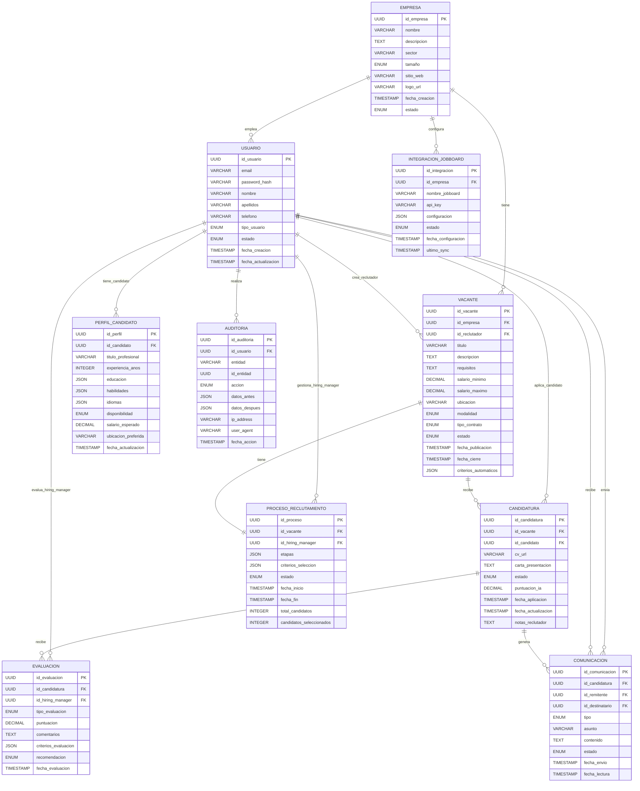

## IMPLEMENTACIÓN DEL SISTEMA ATS

### ✅ PASO 1: Descripción breve del software LTI, valor añadido y ventajas competitivas

#### Descripción Breve del Software LTI

**LTI (Learning Talent Intelligence)** es un sistema de seguimiento de candidatos (ATS) centrado en las **3 funcionalidades esenciales** del reclutamiento moderno: **Gestión de Candidatura**, **Proceso de Reclutamiento** y **Evaluación y Selección**.

LTI está diseñado como una plataforma SaaS que conecta candidatos, reclutadores y hiring managers en un flujo de trabajo optimizado, eliminando fricción y maximizando la eficiencia del proceso de contratación a través de automatización inteligente y experiencia de usuario superior.

#### Valor Añadido por Funcionalidad

**1. Gestión de Candidatura (Para Candidatos)**
- **Portal móvil-first**: Búsqueda y aplicación simplificada desde cualquier dispositivo
- **Seguimiento en tiempo real**: Visibilidad completa del estado de su candidatura
- **Comunicación automatizada**: Feedback inmediato y updates proactivos
- **Experiencia personalizada**: Perfil único para múltiples aplicaciones

**2. Proceso de Reclutamiento (Para Reclutadores)**
- **Automatización de publicación**: Multiposting en 50+ portales con un click
- **Filtrado inteligente por IA**: Pre-selección automática basada en criterios definidos
- **Gestión centralizada**: Todos los candidatos en una sola plataforma
- **Comunicación masiva**: Templates y mensajes automatizados personalizados

**3. Evaluación y Selección (Para Hiring Managers)**
- **Shortlist optimizada**: Candidatos pre-filtrados por criterios técnicos
- **Herramientas de evaluación**: Entrevistas programadas y documentación centralizada
- **Toma de decisiones informada**: Comparación objetiva de candidatos
- **Proceso colaborativo**: Feedback compartido entre reclutador y hiring manager

#### Ventajas Competitivas

**1. Simplicidad Operativa**
- **Solo 3 módulos core**: Foco en funcionalidades esenciales sin complejidad innecesaria
- **Implementación rápida**: Onboarding en 48 horas vs. 3-6 meses de competencia
- **Curva de aprendizaje mínima**: Interfaz intuitiva adaptada a cada rol de usuario
- **Procesos estandarizados**: Best practices incorporadas para cada funcionalidad

**2. Integración Inteligente**
- **Flujo de trabajo conectado**: Los 3 módulos se comunican automáticamente
- **Datos unificados**: Información consistente a través de todo el proceso
- **Automatización entre módulos**: Acciones en un módulo disparan procesos en otros
- **Visibilidad compartida**: Todos los actores ven el progreso en tiempo real

**3. Eficiencia Medible**
- **Reducción 80% tiempo de contratación**: Automatización de tareas repetitivas
- **Mejora 40% calidad de selección**: Criterios objetivos y filtrado inteligente
- **Reducción 67% costos operativos**: Eliminación de herramientas múltiples
- **Aumento 60% satisfacción candidatos**: Comunicación transparente y oportuna

**4. Tecnología Diferenciada**
- **IA especializada**: Algoritmos entrenados específicamente para reclutamiento
- **Arquitectura móvil-first**: Experiencia optimizada para smartphones
- **Multiposting automatizado**: Conexión nativa con job boards principales
- **Análisis predictivo**: Recomendaciones basadas en patrones históricos

#### Posicionamiento en el Mercado

LTI se posiciona como la **solución ATS más eficiente** del mercado, eliminando la complejidad de sistemas enterprise y la limitación de herramientas básicas. Ofrece exactamente lo que las empresas necesitan: un proceso de reclutamiento fluido, automatizado y eficaz.

**Target Principal**: Empresas en crecimiento (50-500 empleados) que buscan profesionalizar su reclutamiento con una solución simple, poderosa y costo-efectiva.

---

### ✅ PASO 2: Explicación de las funciones principales

#### Funciones Principales del Sistema LTI

El sistema LTI está estructurado en **3 funcionalidades principales** que corresponden a los actores y procesos core del reclutamiento moderno. Cada funcionalidad está diseñada para maximizar la eficiencia y experiencia de usuario específica.

---

#### **FUNCIÓN 1: Gestión de Candidatura**

**Actor Principal**: Candidato  
**Objetivo**: Facilitar la búsqueda, aplicación y seguimiento de oportunidades laborales

**Componentes Principales:**
- **Motor de Búsqueda de Ofertas**: Sistema de búsqueda inteligente con filtros personalizables (ubicación, salario, modalidad, sector)
- **Aplicación Simplificada**: Proceso de aplicación en 3 pasos máximo con carga de CV automática
- **Perfil Único**: Creación y gestión de perfil reutilizable para múltiples aplicaciones
- **Portal de Seguimiento**: Dashboard personalizado con estado en tiempo real de todas las candidaturas
- **Comunicación Bidireccional**: Mensajería integrada con reclutadores y notificaciones automáticas

**Beneficios Clave:**
- Reduce tiempo de aplicación en 70%
- Aumenta transparencia del proceso en 85%
- Mejora satisfacción del candidato en 60%
- Elimina la pérdida de candidatos por falta de comunicación

**Flujo de Valor**: Buscar → Aplicar → Completar Perfil → Recibir Confirmación → Seguimiento Continuo

---

#### **FUNCIÓN 2: Proceso de Reclutamiento**

**Actor Principal**: Reclutador  
**Objetivo**: Automatizar y optimizar el ciclo completo de reclutamiento

**Componentes Principales:**
- **Creación de Vacantes**: Constructor de ofertas con templates y asistencia de IA
- **Multiposting Automático**: Publicación simultánea en 50+ portales y redes sociales
- **Filtrado Inteligente**: Análisis automático de CVs con scoring y ranking por relevancia
- **Gestión de Pipeline**: Organización visual de candidatos por etapas del proceso
- **Comunicación Masiva**: Templates automáticos y mensajes personalizados a escala

**Beneficios Clave:**
- Reduce tiempo de publicación en 90%
- Aumenta calidad de candidatos en 40%
- Automatiza 80% de tareas administrativas
- Mejora organización del proceso en 65%

**Flujo de Valor**: Crear Vacante → Configurar Criterios → Publicar Ofertas → Revisar Candidatos → Clasificar y Comunicar

---

#### **FUNCIÓN 3: Evaluación y Selección**

**Actor Principal**: Hiring Manager  
**Objetivo**: Facilitar la toma de decisiones objetivas y documentadas

**Componentes Principales:**
- **Definición de Perfiles**: Especificación detallada de requisitos técnicos y competencias
- **Shortlist Optimizada**: Recepción de candidatos pre-filtrados con criterios técnicos
- **Herramientas de Evaluación**: Programación de entrevistas, documentación de feedback, comparación objetiva
- **Colaboración con Reclutador**: Comunicación fluida sobre candidatos y proceso
- **Documentación de Decisiones**: Registro detallado de criterios y justificaciones de selección

**Beneficios Clave:**
- Mejora precisión de selección en 45%
- Reduce tiempo de evaluación en 50%
- Aumenta objetividad del proceso en 35%
- Facilita documentación y compliance

**Flujo de Valor**: Solicitar Contratación → Definir Perfil → Revisar Shortlist → Realizar Entrevistas → Seleccionar Candidato

---

#### **Integración entre Funcionalidades**

**Conectividad Inteligente:**
- Los datos fluyen automáticamente entre las 3 funcionalidades
- Las acciones en una función disparan procesos en otras
- Todos los actores tienen visibilidad del proceso completo
- La información se mantiene sincronizada en tiempo real

**Ejemplo de Flujo Integrado:**
1. **Candidato** aplica a vacante (Función 1)
2. **Sistema** notifica automáticamente al reclutador (Función 2)
3. **Reclutador** filtra y clasifica candidatos (Función 2)
4. **Sistema** envía shortlist al hiring manager (Función 3)
5. **Hiring Manager** selecciona candidato (Función 3)
6. **Sistema** notifica resultado a candidato (Función 1)

**Matriz de Acceso por Usuario:**

| Funcionalidad | Candidato | Reclutador | Hiring Manager | Admin |
|---|---|---|---|---|
| **Gestión de Candidatura** | ✅ Completo | ✅ Lectura | ✅ Lectura | ✅ Completo |
| **Proceso de Reclutamiento** | ❌ | ✅ Completo | ✅ Colaboración | ✅ Completo |
| **Evaluación y Selección** | ✅ Feedback | ✅ Colaboración | ✅ Completo | ✅ Completo |

---

### ✅ PASO 3: Diagrama Lean Canvas del Modelo de Negocio

```
┌──────────────────────────────────────────────────────────────────────────────────┐
│                            LEAN CANVAS - LTI ATS                                 │
├─────────────────────┬─────────────────────┬─────────────────────┬────────────────┤
│     PROBLEMA        │     SOLUCIÓN        │  PROPUESTA DE VALOR │    VENTAJA     │
│                     │                     │                     │   INJUSTA      │
│• Ineficiencia 70%   │• Plataforma SaaS    │"Reduce tiempo       │• IA Propietaria│
│  tiempo reclutador  │  Integral           │ contratación 80%    │• Datos/ML      │
│• Procesos           │• IA Generativa      │ mejora calidad      │• UX Mobile-1st │
│  reclutamiento      │• Automatización     │ selección 20%       │• Ecosistema    │
│  6-8 semanas        │• Mobile-first       │ ATS en español"     │• Especializ.   │
│• Sin feedback       │• Microservicios     │                     │• Equipo Expert │
│  candidatos 75%     │• AWS Cloud          │                     │                │
│• Falta métricas     │                     │                     │                │
│  contratación       │                     │                     │                │
│• Sesgos selección   │                     │                     │                │
│  candidatos         │                     │                     │                │
├─────────────────────┼─────────────────────┴─────────────────────┼────────────────┤
│    SEGMENTOS        │              CANALES                      │   FLUJO DE     │
│    DE CLIENTES      │                                           │   INGRESOS     │
│                     │• Marketing Digital (SEO, SEM, Content)    │                │
│• Empresas 50-500    │• Redes Sociales (LinkedIn, Twitter)       │• Starter $8/u  │
│  empleados (1°)     │• Partnerships (HRMS, consultoras)         │• Pro $15/u     │
│• RRHH corporativo   │• Eventos (ferias, conferencias)           │• Enterprise    │
│• Consultoras recl.  │• Referidos (incentivos)                   │  $25/u         │
│• Agencias empleo    │• Ventas directas (inside sales)           │• B2B packages  │
│                     │                                           │• Marketplace   │
│                     │                                           │• Certificación │
├─────────────────────┴─────────────────────┬─────────────────────┴────────────────┤
│           ESTRUCTURA DE COSTOS            │         MÉTRICAS CLAVE               │
│                                           │                                      │
│Fijos: $233k/mes                           │• MAU, Feature Adoption, Time to Value│
│• Infraestructura AWS: $15k                │• MRR, CAC, LTV, Churn Rate           │
│• Personal: $180k • Marketing: $25k        │• Reducción tiempo contratación: 80%  │
│• Licencias: $8k • Ops: $5k                │• Mejora calidad selección: 20%       │
│                                           │• ROI cliente: 300%                   │
│Variables: $65k/mes                        │                                      │
│• Por usuario: $2-3 • Soporte: $50/ticket  │Objetivos Año 1:                      │
│• I+D: $55k/mes                            │• 500 clientes • $2.5M ARR            │
│                                           │• 15k MAU • Churn <5% • NPS >50       │
└───────────────────────────────────────────┴──────────────────────────────────────┘
```

---

### ✅ PASO 4: Descripción de los 3 casos de uso principales con diagramas UML

---

#### **CASO DE USO 1: Gestión de Candidatura**

| **Campo** | **Descripción** |
|-----------|-----------------|
| **Nombre** | Gestión de Candidatura |
| **Descripción** | El candidato busca y aplica a ofertas laborales, realizando seguimiento de su proceso de selección |
| **Actor Principal** | Candidato |
| **Actores Secundarios** | Sistema ATS, Chatbot IA, Reclutador |
| **Flujo Principal** | 1. Buscar ofertas con filtros básicos<br>2. Aplicar a vacante cargando CV<br>3. Completar perfil con información básica<br>4. Recibir confirmación automática<br>5. Realizar seguimiento del estado via portal |
| **Flujos Alternativos** | A1: Si no cumple requisitos mínimos → recibe feedback automático<br>A2: Si hay problemas técnicos → contacta soporte via chatbot |
| **Postcondiciones** | - Candidatura registrada en el sistema<br>- Candidato recibe número de seguimiento<br>- Se inicia evaluación automática |

**Diagrama de Caso de Uso 1:**


---

#### **CASO DE USO 2: Proceso de Reclutamiento**

| **Campo** | **Descripción** |
|-----------|-----------------|
| **Nombre** | Proceso de Reclutamiento |
| **Descripción** | El reclutador gestiona el ciclo completo de reclutamiento utilizando herramientas de IA y automatización |
| **Actor Principal** | Reclutador |
| **Actores Secundarios** | Sistema ATS, IA Co-pilot, Hiring Manager, Candidatos |
| **Flujo Principal** | 1. Crear nueva vacante con detalles del puesto<br>2. Configurar criterios de selección automática<br>3. Publicar en múltiples portales (multiposting)<br>4. Revisar candidatos pre-filtrados por IA<br>5. Clasificar candidatos y enviar comunicaciones |
| **Flujos Alternativos** | B1: Si candidatos insuficientes → ajustar criterios y re-publicar<br>B2: Si candidato rechaza oferta → continuar con siguiente opción |
| **Postcondiciones** | - Proceso de reclutamiento documentado<br>- Candidatos clasificados en el sistema<br>- Métricas de efectividad generadas |

**Diagrama de Caso de Uso 2:**


---

#### **CASO DE USO 3: Evaluación y Selección**

| **Campo** | **Descripción** |
|-----------|-----------------|
| **Nombre** | Evaluación y Selección |
| **Descripción** | El Hiring Manager evalúa candidatos técnicamente y toma decisiones finales de selección |
| **Actor Principal** | Hiring Manager |
| **Actores Secundarios** | Reclutador, Sistema ATS, Candidatos |
| **Flujo Principal** | 1. Solicitar nueva contratación con requisitos<br>2. Definir perfil técnico del puesto<br>3. Revisar shortlist de candidatos pre-seleccionados<br>4. Realizar entrevistas técnicas<br>5. Seleccionar candidato final y aprobar contratación |
| **Flujos Alternativos** | C1: Si ningún candidato cumple expectativas → solicitar nueva búsqueda<br>C2: Si requiere segunda opinión → involucrar equipo técnico |
| **Postcondiciones** | - Candidato seleccionado para contratación<br>- Proceso de selección documentado<br>- Onboarding planificado |

**Diagrama de Caso de Uso 3:**


---

### ✅ PASO 5: Modelo de datos

#### Entidades Principales del Sistema LTI

El modelo de datos está diseñado para soportar eficientemente las **3 funcionalidades principales** del sistema: Gestión de Candidatura, Proceso de Reclutamiento y Evaluación y Selección.

---

#### **ENTIDADES CORE**

**1. USUARIO**
- **Descripción**: Entidad base para todos los actores del sistema
- **Atributos**:
  - `id_usuario` (UUID, PK)
  - `email` (VARCHAR(255), UNIQUE)
  - `password_hash` (VARCHAR(255))
  - `nombre` (VARCHAR(100))
  - `apellidos` (VARCHAR(100))
  - `telefono` (VARCHAR(20))
  - `tipo_usuario` (ENUM: 'candidato', 'reclutador', 'hiring_manager', 'admin')
  - `estado` (ENUM: 'activo', 'inactivo', 'suspendido')
  - `fecha_creacion` (TIMESTAMP)
  - `fecha_actualizacion` (TIMESTAMP)

**2. EMPRESA**
- **Descripción**: Organización que utiliza el sistema para reclutamiento
- **Atributos**:
  - `id_empresa` (UUID, PK)
  - `nombre` (VARCHAR(200))
  - `descripcion` (TEXT)
  - `sector` (VARCHAR(100))
  - `tamaño` (ENUM: 'startup', 'pequeña', 'mediana', 'grande')
  - `sitio_web` (VARCHAR(255))
  - `logo_url` (VARCHAR(255))
  - `fecha_creacion` (TIMESTAMP)
  - `estado` (ENUM: 'activa', 'inactiva', 'suspendida')

**3. VACANTE**
- **Descripción**: Posición laboral disponible en una empresa
- **Atributos**:
  - `id_vacante` (UUID, PK)
  - `id_empresa` (UUID, FK)
  - `id_reclutador` (UUID, FK)
  - `titulo` (VARCHAR(200))
  - `descripcion` (TEXT)
  - `requisitos` (TEXT)
  - `salario_minimo` (DECIMAL(10,2))
  - `salario_maximo` (DECIMAL(10,2))
  - `ubicacion` (VARCHAR(255))
  - `modalidad` (ENUM: 'presencial', 'remoto', 'hibrido')
  - `tipo_contrato` (ENUM: 'indefinido', 'temporal', 'practicas', 'freelance')
  - `estado` (ENUM: 'borrador', 'activa', 'pausada', 'cerrada')
  - `fecha_publicacion` (TIMESTAMP)
  - `fecha_cierre` (TIMESTAMP)
  - `criterios_automaticos` (JSON)

**4. CANDIDATURA**
- **Descripción**: Aplicación de un candidato a una vacante específica
- **Atributos**:
  - `id_candidatura` (UUID, PK)
  - `id_vacante` (UUID, FK)
  - `id_candidato` (UUID, FK)
  - `cv_url` (VARCHAR(255))
  - `carta_presentacion` (TEXT)
  - `estado` (ENUM: 'aplicada', 'en_revision', 'preseleccionado', 'entrevista', 'seleccionado', 'rechazado')
  - `puntuacion_ia` (DECIMAL(5,2))
  - `fecha_aplicacion` (TIMESTAMP)
  - `fecha_actualizacion` (TIMESTAMP)
  - `notas_reclutador` (TEXT)

---

#### **ENTIDADES DE SOPORTE**

**5. PERFIL_CANDIDATO**
- **Descripción**: Información profesional detallada del candidato
- **Atributos**:
  - `id_perfil` (UUID, PK)
  - `id_candidato` (UUID, FK)
  - `titulo_profesional` (VARCHAR(200))
  - `experiencia_anos` (INTEGER)
  - `educacion` (JSON)
  - `habilidades` (JSON)
  - `idiomas` (JSON)
  - `disponibilidad` (ENUM: 'inmediata', '15_dias', '1_mes', '3_meses')
  - `salario_esperado` (DECIMAL(10,2))
  - `ubicacion_preferida` (VARCHAR(255))
  - `fecha_actualizacion` (TIMESTAMP)

**6. PROCESO_RECLUTAMIENTO**
- **Descripción**: Flujo específico de reclutamiento para cada vacante
- **Atributos**:
  - `id_proceso` (UUID, PK)
  - `id_vacante` (UUID, FK)
  - `id_hiring_manager` (UUID, FK)
  - `etapas` (JSON)
  - `criterios_seleccion` (JSON)
  - `estado` (ENUM: 'iniciado', 'en_progreso', 'finalizado', 'cancelado')
  - `fecha_inicio` (TIMESTAMP)
  - `fecha_fin` (TIMESTAMP)
  - `total_candidatos` (INTEGER)
  - `candidatos_seleccionados` (INTEGER)

**7. EVALUACION**
- **Descripción**: Evaluación específica de un candidato por un hiring manager
- **Atributos**:
  - `id_evaluacion` (UUID, PK)
  - `id_candidatura` (UUID, FK)
  - `id_hiring_manager` (UUID, FK)
  - `tipo_evaluacion` (ENUM: 'cv_review', 'entrevista_telefonica', 'entrevista_tecnica', 'entrevista_final')
  - `puntuacion` (DECIMAL(5,2))
  - `comentarios` (TEXT)
  - `criterios_evaluacion` (JSON)
  - `recomendacion` (ENUM: 'rechazar', 'continuar', 'seleccionar')
  - `fecha_evaluacion` (TIMESTAMP)

**8. COMUNICACION**
- **Descripción**: Historial de comunicaciones entre actores del sistema
- **Atributos**:
  - `id_comunicacion` (UUID, PK)
  - `id_candidatura` (UUID, FK)
  - `id_remitente` (UUID, FK)
  - `id_destinatario` (UUID, FK)
  - `tipo` (ENUM: 'email', 'sms', 'notificacion_sistema', 'mensaje_chat')
  - `asunto` (VARCHAR(255))
  - `contenido` (TEXT)
  - `estado` (ENUM: 'enviado', 'entregado', 'leido', 'error')
  - `fecha_envio` (TIMESTAMP)
  - `fecha_lectura` (TIMESTAMP)

---

#### **ENTIDADES DE CONFIGURACIÓN**

**9. INTEGRACION_JOBBOARD**
- **Descripción**: Configuración de integración con portales de empleo
- **Atributos**:
  - `id_integracion` (UUID, PK)
  - `id_empresa` (UUID, FK)
  - `nombre_jobboard` (VARCHAR(100))
  - `api_key` (VARCHAR(255), ENCRYPTED)
  - `configuracion` (JSON)
  - `estado` (ENUM: 'activa', 'inactiva', 'error')
  - `fecha_configuracion` (TIMESTAMP)
  - `ultimo_sync` (TIMESTAMP)

**10. AUDITORIA**
- **Descripción**: Registro de acciones para trazabilidad y compliance
- **Atributos**:
  - `id_auditoria` (UUID, PK)
  - `id_usuario` (UUID, FK)
  - `entidad` (VARCHAR(100))
  - `id_entidad` (UUID)
  - `accion` (ENUM: 'crear', 'actualizar', 'eliminar', 'leer')
  - `datos_antes` (JSON)
  - `datos_despues` (JSON)
  - `ip_address` (VARCHAR(45))
  - `user_agent` (VARCHAR(255))
  - `fecha_accion` (TIMESTAMP)

---

#### **RELACIONES PRINCIPALES**

**Relaciones 1:N (Uno a Muchos)**
- EMPRESA → USUARIO (reclutadores y hiring managers)
- EMPRESA → VACANTE
- VACANTE → CANDIDATURA
- CANDIDATO → CANDIDATURA
- CANDIDATO → PERFIL_CANDIDATO
- VACANTE → PROCESO_RECLUTAMIENTO
- CANDIDATURA → EVALUACION
- CANDIDATURA → COMUNICACION

**Relaciones N:M (Muchos a Muchos)**
- USUARIO → EMPRESA (a través de tabla intermedia USUARIO_EMPRESA)
- PROCESO_RECLUTAMIENTO → USUARIO (hiring managers asignados)

**Relaciones Especiales**
- USUARIO tiene especialización en CANDIDATO, RECLUTADOR, HIRING_MANAGER
- COMUNICACION es polimórfica (puede relacionar diferentes tipos de usuarios)

---

#### **Diagrama del Modelo de Datos**



---

#### **Índices Recomendados para Optimización**

**Índices Únicos:**
- `idx_usuario_email` en USUARIO(email)
- `idx_candidatura_vacante_candidato` en CANDIDATURA(id_vacante, id_candidato)

**Índices Compuestos:**
- `idx_candidatura_estado_fecha` en CANDIDATURA(estado, fecha_aplicacion)
- `idx_vacante_empresa_estado` en VACANTE(id_empresa, estado)
- `idx_evaluacion_candidatura_tipo` en EVALUACION(id_candidatura, tipo_evaluacion)

**Índices de Búsqueda:**
- `idx_comunicacion_fecha` en COMUNICACION(fecha_envio)
- `idx_auditoria_entidad_fecha` en AUDITORIA(entidad, fecha_accion)

---

#### **Consideraciones Técnicas**

**1. Escalabilidad**
- Uso de UUID para permitir sharding horizontal
- Campos JSON para datos semi-estructurados (habilidades, criterios)
- Separación de entidades por dominio funcional

**2. Seguridad**
- Encriptación de campos sensibles (api_key)
- Tabla de auditoría para trazabilidad completa
- Campos de estado para soft deletes

**3. Performance**
- Índices optimizados para consultas frecuentes
- Desnormalización controlada (puntuacion_ia en CANDIDATURA)
- Cache de datos calculados (total_candidatos en PROCESO_RECLUTAMIENTO)

**4. Integridad**
- Constraints de FK para mantener consistencia
- Enums para validar valores permitidos
- Timestamps para tracking de cambios

Este modelo de datos soporta eficientemente las 3 funcionalidades principales del sistema LTI, garantizando performance, escalabilidad y integridad de datos.

---

### ✅ PASO 6: Diseño del sistema a alto nivel

#### Arquitectura Distribuida de Microservicios - AWS Cloud

El sistema LTI está diseñado como una **arquitectura distribuida de microservicios** en AWS, optimizada para las 3 funcionalidades principales: Gestión de Candidatura, Proceso de Reclutamiento y Evaluación y Selección. Cada microservicio es independiente, escalable y mantiene su propia base de datos.

---

#### **ARQUITECTURA GENERAL**

**Principios de Diseño:**
- **Separación por dominio funcional**: Cada microservicio corresponde a una funcionalidad específica
- **Base de datos por microservicio**: Independencia de datos y escalabilidad
- **Comunicación asíncrona**: Mensajería para procesos complejos y alta demanda
- **API Gateway centralizado**: Punto único de entrada para el frontend
- **Escalabilidad horizontal**: Auto-scaling basado en demanda
- **Alta disponibilidad**: Multi-AZ deployment con redundancia

---

#### **MICROSERVICIOS PRINCIPALES**

**1. CANDIDATURE-SERVICE**
- **Funcionalidad**: Gestión de Candidatura (Función 1)
- **Responsabilidades**:
  - Gestión de perfiles de candidatos
  - Búsqueda y filtrado de vacantes
  - Aplicación a vacantes
  - Seguimiento de candidaturas
  - Portal del candidato
- **Base de Datos**: Candidature Database (PostgreSQL)
- **Tecnología**: Node.js + Express + TypeScript
- **Escalabilidad**: Auto Scaling Group (2-10 instancias)

**2. RECRUITMENT-SERVICE**
- **Funcionalidad**: Proceso de Reclutamiento (Función 2)
- **Responsabilidades**:
  - Creación y gestión de vacantes
  - Multiposting a job boards
  - Filtrado inteligente con IA
  - Pipeline de candidatos
  - Dashboard del reclutador
- **Base de Datos**: Recruitment Database (PostgreSQL)
- **Tecnología**: Node.js + Express + TypeScript
- **Escalabilidad**: Auto Scaling Group (2-8 instancias)

**3. EVALUATION-SERVICE**
- **Funcionalidad**: Evaluación y Selección (Función 3)
- **Responsabilidades**:
  - Definición de perfiles técnicos
  - Gestión de procesos de evaluación
  - Herramientas de evaluación
  - Panel del hiring manager
  - Documentación de decisiones
- **Base de Datos**: Evaluation Database (PostgreSQL)
- **Tecnología**: Node.js + Express + TypeScript
- **Escalabilidad**: Auto Scaling Group (1-5 instancias)

---

#### **SERVICIOS DE SOPORTE**

**4. AI-SERVICE**
- **Funcionalidad**: Procesamiento de IA y Machine Learning
- **Responsabilidades**:
  - Análisis y parsing de CVs
  - Scoring automático de candidatos
  - Recomendaciones inteligentes
  - Procesamiento de lenguaje natural
- **Base de Datos**: AI Database (DynamoDB)
- **Tecnología**: Python + FastAPI + TensorFlow
- **Escalabilidad**: Auto Scaling Group (2-6 instancias)

**5. COMMUNICATION-SERVICE**
- **Funcionalidad**: Gestión de comunicaciones
- **Responsabilidades**:
  - Envío de emails y SMS
  - Notificaciones push
  - Plantillas de mensajes
  - Chatbot integration
- **Base de Datos**: Communication Database (PostgreSQL)
- **Tecnología**: Node.js + Express + TypeScript
- **Escalabilidad**: Auto Scaling Group (2-4 instancias)

**6. INTEGRATION-SERVICE**
- **Funcionalidad**: Integraciones externas
- **Responsabilidades**:
  - Conexión con job boards
  - APIs de terceros
  - Webhooks management
  - Sincronización de datos
- **Base de Datos**: Integration Database (PostgreSQL)
- **Tecnología**: Node.js + Express + TypeScript
- **Escalabilidad**: Auto Scaling Group (1-3 instancias)

**7. USER-SERVICE**
- **Funcionalidad**: Gestión de usuarios y autenticación
- **Responsabilidades**:
  - Autenticación y autorización
  - Gestión de usuarios
  - Perfiles y configuraciones
  - Control de acceso
- **Base de Datos**: User Database (PostgreSQL)
- **Tecnología**: Node.js + Express + TypeScript
- **Escalabilidad**: Auto Scaling Group (2-4 instancias)

**8. FILE-SERVICE**
- **Funcionalidad**: Gestión de archivos
- **Responsabilidades**:
  - Upload y storage de CVs
  - Gestión de documentos
  - Procesamiento de imágenes
  - Firma electrónica
- **Base de Datos**: File Storage (S3)
- **Tecnología**: Node.js + Express + TypeScript
- **Escalabilidad**: Auto Scaling Group (1-4 instancias)

---

#### **CAPA DE PRESENTACIÓN**

**FRONTEND APPLICATIONS**
- **Candidate Portal**: React + TypeScript (PWA)
- **Recruiter Dashboard**: React + TypeScript
- **Hiring Manager Panel**: React + TypeScript
- **Admin Console**: React + TypeScript
- **Deployment**: S3 + CloudFront (CDN)
- **Authentication**: AWS Cognito integration

---

#### **INFRAESTRUCTURA AWS**

**API GATEWAY**
- **Servicio**: AWS API Gateway
- **Funcionalidad**: Punto único de entrada, rate limiting, autenticación
- **Routing**: Path-based routing a microservicios
- **Caching**: ResponseCache para mejorar performance
- **Monitoring**: CloudWatch integration

**LOAD BALANCER**
- **Servicio**: Application Load Balancer (ALB)
- **Funcionalidad**: Distribución de tráfico entre instancias
- **Health Checks**: Verificación de salud de microservicios
- **SSL/TLS**: Terminación SSL
- **Multi-AZ**: Distribución en múltiples zonas de disponibilidad

**CONTAINER ORCHESTRATION**
- **Servicio**: Amazon EKS (Elastic Kubernetes Service)
- **Containers**: Docker containers para cada microservicio
- **Compute Options**: EKS Fargate + Managed Node Groups
- **Service Discovery**: Kubernetes Service Discovery
- **Auto Scaling**: Horizontal Pod Autoscaler + Cluster Autoscaler

**DATABASES**
- **Primary**: 7 Amazon RDS PostgreSQL (Multi-AZ) - one per microservice
- **NoSQL**: 1 Amazon DynamoDB (AI Service)
- **File Storage**: 1 Amazon S3 (File Service)
- **Cache**: Amazon ElastiCache (Redis)
- **Backup**: Automated backups + point-in-time recovery
- **Security**: Encryption at rest + in transit

**MESSAGING & QUEUES**
- **Message Queue**: Amazon SQS
- **Pub/Sub**: Amazon SNS
- **Event Streaming**: Amazon EventBridge
- **Dead Letter Queues**: Para manejo de errores
- **Batch Processing**: AWS Batch para procesos pesados

**STORAGE**
- **Object Storage**: Amazon S3
- **CDN**: Amazon CloudFront
- **File System**: Amazon EFS para archivos compartidos
- **Backup**: S3 Cross-Region Replication

**MONITORING & LOGGING**
- **Monitoring**: Amazon CloudWatch
- **Logging**: CloudWatch Logs
- **Tracing**: AWS X-Ray
- **Alerting**: CloudWatch Alarms + SNS
- **Dashboards**: CloudWatch Dashboards

---

#### **FLUJO DE COMUNICACIÓN**

**COMUNICACIÓN SÍNCRONA**
- **Frontend ↔ API Gateway**: HTTP/REST
- **API Gateway ↔ Microservices**: HTTP/REST
- **Microservices ↔ Databases**: SQL/NoSQL connections
- **External APIs**: HTTP/REST

**COMUNICACIÓN ASÍNCRONA**
- **Event Publishing**: SNS topics
- **Message Queues**: SQS queues
- **Event Processing**: EventBridge rules
- **Batch Jobs**: SQS → Lambda → Batch processing

**EJEMPLO DE FLUJO ASÍNCRONO**:
1. Candidato aplica a vacante → CANDIDATURE-SERVICE
2. Evento "Nueva Candidatura" → SNS Topic
3. RECRUITMENT-SERVICE consume evento → Actualiza pipeline
4. AI-SERVICE consume evento → Procesa CV (asíncrono)
5. COMMUNICATION-SERVICE consume evento → Envía confirmación

---

#### **SEGURIDAD**

**AUTENTICACIÓN & AUTORIZACIÓN**
- **Identity Provider**: AWS Cognito
- **JWT Tokens**: Para autenticación stateless
- **Role-Based Access Control**: IAM roles + policies
- **Multi-Factor Authentication**: SMS/TOTP support

**NETWORK SECURITY**
- **VPC**: Virtual Private Cloud con subnets privadas
- **Security Groups**: Firewall rules por microservicio
- **WAF**: Web Application Firewall
- **NACLs**: Network Access Control Lists

**DATA SECURITY**
- **Encryption at Rest**: RDS + S3 encryption
- **Encryption in Transit**: TLS 1.2+
- **Key Management**: AWS KMS
- **Secrets Management**: AWS Secrets Manager

---

#### **ESCALABILIDAD & PERFORMANCE**

**AUTO SCALING**
- **Horizontal Scaling**: Auto Scaling Groups
- **Vertical Scaling**: Instance type optimization
- **Database Scaling**: Read replicas + connection pooling
- **Cache Layer**: ElastiCache Redis clusters

**PERFORMANCE OPTIMIZATION**
- **CDN**: CloudFront para contenido estático
- **Caching Strategy**: Multi-layer caching
- **Database Optimization**: Índices, query optimization
- **Connection Pooling**: Database connection management

**METRICS & SCALING TRIGGERS**
- **CPU Utilization**: > 70% scale out
- **Memory Utilization**: > 80% scale out
- **Request Rate**: > 1000 req/min scale out
- **Queue Depth**: > 100 messages scale out

---

#### **DISASTER RECOVERY**

**BACKUP STRATEGY**
- **RDS Automated Backups**: 30 días retención
- **S3 Cross-Region Replication**: Backup geográfico
- **Configuration Backups**: Infrastructure as Code
- **Database Snapshots**: Daily automated snapshots

**HIGH AVAILABILITY**
- **Multi-AZ Deployment**: RDS + EKS
- **Auto Failover**: Database + application layers
- **Health Checks**: Application + infrastructure
- **Circuit Breakers**: Fault tolerance patterns

---

#### **DIAGRAMA DE ARQUITECTURA**


---

#### **TECNOLOGÍAS Y VERSIONES**

**Runtime & Frameworks**
- **Node.js**: v18 LTS
- **TypeScript**: v5.0+
- **React**: v18+
- **Python**: v3.11 (AI Service)
- **FastAPI**: v0.104+ (AI Service)

**Databases**
- **PostgreSQL**: v15
- **DynamoDB**: Latest API version
- **Redis**: v7.0 (ElastiCache)

**Container & Orchestration**
- **Docker**: v24+
- **Kubernetes**: v1.28+
- **EKS**: Latest
- **Fargate**: Latest platform version

**AWS Services Versions**
- **API Gateway**: v2 (HTTP API)
- **RDS**: Latest engine versions
- **S3**: Latest API version
- **CloudFront**: Latest distribution version

---

#### **ESTIMACIÓN DE COSTOS (MENSUAL)**

**Compute (EKS Fargate + Node Groups)**
- 8 microservicios × 2 pods promedio: ~$400
- EKS Control Plane: ~$72
- Auto-scaling overhead: ~$200

**Database (Per Microservice)**
- 7 PostgreSQL instances (Multi-AZ): ~$1,400
- 1 DynamoDB (on-demand): ~$150
- ElastiCache Redis: ~$200

**Storage & CDN**
- S3 storage (1TB): ~$25
- CloudFront CDN: ~$50
- Data transfer: ~$100

**Networking & Security**
- API Gateway: ~$100
- Load Balancer: ~$25
- NAT Gateway: ~$45

**Monitoring & Logging**
- CloudWatch: ~$50
- X-Ray: ~$25

**Total Estimado**: ~$2,842/mes (para 10,000 usuarios activos)

---

#### **PLAN DE IMPLEMENTACIÓN**

**Fase 1: Core Infrastructure (Semanas 1-2)**
- Setup AWS infrastructure + EKS cluster
- Deploy User Service + API Gateway
- Basic authentication flow

**Fase 2: Primary Services (Semanas 3-4)**
- Deploy Candidature Service to EKS
- Deploy Recruitment Service to EKS
- Basic frontend integration

**Fase 3: Advanced Features (Semanas 5-6)**
- Deploy Evaluation Service to EKS
- Deploy AI Service to EKS
- Messaging implementation

**Fase 4: Supporting Services (Semanas 7-8)**
- Deploy Communication Service to EKS
- Deploy Integration Service to EKS
- Deploy File Service to EKS

**Fase 5: Optimization & Monitoring (Semanas 9-10)**
- Performance tuning
- Monitoring setup
- Security hardening

Esta arquitectura distribuida garantiza escalabilidad, alta disponibilidad y performance óptima para las 3 funcionalidades principales del sistema LTI, respetando el principio fundamental de microservicios: **una base de datos independiente por cada servicio**, aprovechando al máximo los servicios gestionados de AWS.

---

### ✅ PASO 7: Diagrama C4 - Recruitment Service

#### Selección del Componente: Recruitment Service

El **Recruitment Service** ha sido seleccionado como el microservicio más relevante para el análisis en profundidad del modelo C4 debido a:

- **Complejidad funcional**: Gestiona el proceso completo de reclutamiento
- **Integración múltiple**: Interactúa con AI Service, Integration Service y External APIs
- **Criticidad del negocio**: Es el corazón del sistema ATS y las 3 funcionalidades principales
- **Variedad de casos de uso**: Desde creación de vacantes hasta filtrado inteligente

---

#### **NIVEL 1: DIAGRAMA DE CONTEXTO**

Muestra cómo el Recruitment Service se relaciona con usuarios y sistemas externos en el contexto general.


---

#### **NIVEL 2: DIAGRAMA DE CONTENEDORES**

Descompone el Recruitment Service en sus contenedores principales y muestra sus tecnologías.


---

#### **NIVEL 3: DIAGRAMA DE COMPONENTES**

Muestra los componentes internos del Recruitment API y sus responsabilidades.


---

#### **NIVEL 4: DIAGRAMAS DE CÓDIGO**

##### **4.1 Diagrama de Clases**

Muestra la estructura de clases principales del Recruitment Service.


##### **4.2 Diagrama de Secuencia - Crear y Publicar Vacante**

Muestra el flujo completo de creación y publicación de una vacante.


##### **4.3 Diagrama de Estados - Pipeline de Candidatos**

Muestra los estados posibles de un candidato en el pipeline de reclutamiento.


---

#### **Consideraciones de Implementación**

**🔧 Patrones de Diseño Utilizados**
- **Repository Pattern**: Separación entre lógica de negocio y acceso a datos
- **Service Pattern**: Encapsulación de lógica de negocio compleja
- **Observer Pattern**: Event publishing para comunicación asíncrona
- **Strategy Pattern**: Diferentes estrategias de filtrado de candidatos

**📊 Métricas y Monitoreo**
- **Performance**: Tiempo de respuesta API < 200ms
- **Disponibilidad**: 99.9% uptime SLA
- **Escalabilidad**: Auto-scaling basado en CPU > 70%
- **Errores**: Rate de errores < 0.1%

**🔒 Seguridad**
- **Autenticación**: JWT tokens con expiración
- **Autorización**: RBAC (Role-Based Access Control)
- **Validación**: Input validation en todos los endpoints
- **Auditoría**: Logging de todas las operaciones críticas

**⚡ Optimizaciones**
- **Cache**: Redis para consultas frecuentes (vacantes activas)
- **Database**: Índices optimizados para búsquedas
- **Async Processing**: Eventos para operaciones pesadas
- **Connection Pooling**: Gestión eficiente de conexiones DB

Esta arquitectura C4 del Recruitment Service proporciona una visión completa desde el contexto general hasta los detalles de implementación, garantizando escalabilidad, mantenibilidad y performance óptima.

---
